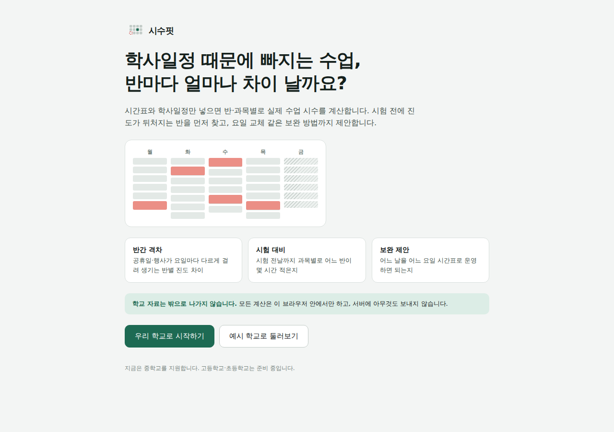

# 교무핏

학교 교무업무를 돕는 무료 웹 도구 모음입니다. 첫 화면(홈)에서 도구와 우리 학교 자료가 어디까지 와 있는지 보고, 사이드바 맨 위에서 도구를 바꿉니다. 학교 정보·시간표·학사일정은 도구들이 함께 씁니다.

| 도구 | 하는 일 |
|---|---|
| **학사일정 짜기** | 작년 학사일정을 넣으면 새 학년도 공휴일에 맞춰 1차안을 짜고, 교사들이 구글 시트에서 함께 고침 |
| **시수 점검 (시수핏)** | 학사일정 때문에 빠지는 수업을 반·과목별로 계산하고, 시험 전 반간 격차와 보완 방법을 찾음 |
| **시간표 교체** (베타) | 출장·연가로 빠지는 수업을 교체(맞바꾸기) 먼저, 안 되면 보강 선생님을 학교 조건(같은 과목·담임·같은 학년·하루 최대·연강·보강 몰림)에 맞춰 찾고 안내문을 만듦 |

## 학사일정 짜기

1. **작년 일정 넣기**: 구글 캘린더(.ics), 학사일정 시트(.xlsx, 목록형·달력형), NEIS, 붙여넣기
2. **새 학년도 기본값**: 학기 첫날·마지막 날 (작년과 같은 요일·주차로 추정)
3. **1차안 검토**: 일정마다 어떻게 옮겼는지 근거가 붙고, 확인이 필요한 일정부터 봄

1차안은 날짜를 그대로 1년 미루지 않습니다. 일정마다 무엇에 맞춰 잡힌 날인지 찾아 새 학년도에서 다시 풉니다.

| 작년 일정 | 새 학년도 |
|---|---|
| 개학식·입학식·방학식·종업식, 그날의 다른 일정 | 새 학기 첫날·마지막 날 |
| "4월 넷째 주 월~수 중간고사" | 같은 달 같은 주차·요일 |
| 시험 다음 날 체육대회 | 시험을 따라감 |
| 개교기념일 | 같은 날짜 |
| 징검다리 재량휴업일 | 작년 날짜 대신 새해 징검다리(공휴일과 주말 사이 평일)를 다시 찾아 제안 |
| 매주 교직원 회의 | 새 달력에서 다시 펼치고 휴일은 건너뜀 |
| 영어듣기평가·학업성취도평가·수능 | 임시 배치 후 "확인 필요" (교육청 공문 날짜) |
| 공휴일·다른 큰 행사와 겹침 | 가까운 날 후보를 내고 "확인 필요" (자동 확정 안 함) |

- 수업일수(법정 190일 이상), 학기별·요일별 수업일수를 늘 보여 줍니다.
- **함께 고치기**: 구글 시트로 만들어(Apps Script) 또는 시트용 파일로 내려받아 선생님들이 함께 고친 뒤, 앱에서 다시 읽어 겹침을 점검합니다. 캘린더 파일(.ics)로도 내보냅니다.
- **AI에게 부탁하기** (선택): "수련회는 5월 둘째 주로" 같은 요청이나 확인 필요 일정 검토를 AI(Claude)에게 맡깁니다. 제안은 규칙으로 검사한 뒤 교사가 고른 것만 적용합니다. 교사 본인의 Anthropic API 키가 필요하고, 일정 이름과 날짜만 보냅니다.
- 1차안을 **시수 점검**으로 보내 반·과목 시수 균형을 미리 봅니다.

## 시수 점검 (시수핏)

**학사일정 때문에 빠지는 수업, 반마다 얼마나 차이 날까요?** 학교 시간표와 학사일정을 넣으면 반·과목별 실제 수업 시수를 계산합니다.



- **반간 격차**: 공휴일·행사·특별교육이 요일마다 다르게 걸려 생기는 반별 진도 차이
- **시험 대비**: 시험 전날까지 과목별로 어느 반이 몇 시간 적게 수업했는지
- **편제 확인**: 학기 목표 시수(주당 시수 × 17주)보다 부족한 반·과목
- **교사 시수**: 교사별 주당 시수, 한 요일에 몰린 수업, 학사일정 때문에 빠지는 수업
- **보완 제안**: "○월 ○일을 ○요일 시간표로 운영", "행사를 ○교시로 옮기기"처럼 격차를 줄이는 방법

> 학교 자료는 밖으로 나가지 않습니다. 모든 계산은 사용하는 사람의 브라우저 안에서만 이루어지고, 서버에 아무것도 보내지 않습니다. (예외: 교사가 직접 켜는 AI 도움은 일정 이름과 날짜를 AI로 보냅니다.)

## 바로 쓰기

**https://cleveranawim-source.github.io/officetool/**

1. **우리 학교로 시작하기** → 학교 이름·학기 기간 입력
2. **시간표** 엑셀 파일 올리기 (시간표 프로그램의 "전체 학반 시간표" 또는 "학반별 시간표")
   - 또는 **NEIS**: 학교가 NEIS에 올린 날짜별 시간표 3주를 받아 반·요일·교시마다 가장 많이 나온 과목으로 평소 시간표를 만듭니다 (교사 이름은 없음)
3. **학사일정** 넣기: 구글 캘린더에서 받은 `.ics` 파일, 또는 구글 시트·엑셀 학사일정표(.xlsx 올리기나 복사해 붙여넣기)
   - 목록형(`날짜 | 일정`)과 **달력형**(월~금 칸에 날짜와 그날 일정) 모두 알아서 알아봅니다
   - 또는 **NEIS**: 학교 이름으로 찾아 학교가 NEIS에 입력한 학사일정을 바로 받기 (open.neis.go.kr 인증키 필요, 무료)
   - 달력형은 한 칸에 여러 줄 일정, ♥·♠ 같은 표시, 달·해가 바뀌는 주, 한 시트에 이어 붙인 1·2학기 표를 읽습니다
4. 자동 분류 결과 확인 → 결과 보기

설정은 브라우저에 저장됩니다. 같은 학교 선생님과 나누려면 `데이터·설정 → 설정 파일 저장`으로 받은 파일을 전달하세요.

지금은 **중학교**를 지원합니다. 고등학교(고교학점제)와 초등학교는 준비 중입니다.

## 학사일정 이름은 이렇게 읽습니다

| 일정 이름 | 계산 |
|---|---|
| `진로교육 1-7`, `1-7 백마페스티벌` | 1~7교시를 행사로 대체 (교시 숫자는 앞이든 뒤든) |
| `함께하는 삶1`, `3감염병예방교육` | 그 교시 하나를 특별교육으로 대체 |
| `6(1)`, `독서감상문쓰기대회6(5)` | 6교시에 1교시(5교시) 수업을 하고, 비는 교시는 그날 행사에 씀 |
| `영어듣기평가1-3(학년별)` | 1학년 1교시, 2학년 2교시, 3학년 3교시 |
| `(1,2학년) 중간고사`, `2학년 수련회`, `(2,3년)개학식1` | 해당 학년만 |
| `아동학대예방교육(6)`, `검사(4교시)` | 괄호 안 교시 하나 |
| `재량휴업일`, 공휴일 | 수업 없음. 법정 공휴일은 자동으로 들어감 |
| `목요일 시간표 운영`, `수요일 수업` | 그날 그 요일 시간표로 수업 |
| `부장회의1`, `교직원 연수` | 교직원 일정: 학생 수업과 무관 |

학교마다 쓰는 말이 다르므로 `데이터·설정 → 일정 읽는 규칙`에서 낱말을 더하거나 뺄 수 있습니다. 자동 분류가 틀린 일정은 `학사일정` 화면에서 하나씩 고칠 수도 있습니다.

## 함께 만들기

오픈소스(MIT)입니다. 표기 방식이 다른 학교의 사례, 읽지 못하는 시간표 형식, 틀린 계산을 알려 주시면 가장 큰 도움이 됩니다. [CONTRIBUTING.md](CONTRIBUTING.md)를 보세요.

## 개발

```bash
cd web
npm install
npm run dev     # 로컬 미리보기
npm test        # 계산 엔진 테스트
npm run build   # dist/index.html 한 파일로 빌드
```

```
web/src/engine/   계산 엔진 (화면과 분리된 순수 함수, 테스트 포함)
  parseEvents.ts    일정 이름 → 시수 규칙
  compute.ts        반·과목·날짜별 시수 계산
  suggest.ts        보완 제안 탐색
  planner.ts        학사일정 1차안 (기준 찾기·충돌·징검다리·수업일수)
  planSheet.ts      1차안 ↔ 구글 시트, planAI.ts  AI 제안 프롬프트·검사
  importTimetable.ts, ics.ts, eventList.ts, calendarGrid.ts, neis.ts   가져오기
web/src/ui/       화면 (Preact)
apps-script/      (선택) 구글 Apps Script 웹앱: 학교 캘린더 직접 연결
docs/             기획·설계·배포 문서
```

`main` 또는 개발 브랜치에 올리면 GitHub Actions가 테스트 후 GitHub Pages에 자동 배포합니다.

## 문서

- [기획](docs/00-brainstorm.md) · [설계와 결정 사항](docs/01-design.md) · [Apps Script 배포](docs/02-deploy.md) · [전국 배포 전략](docs/03-distribution.md)
